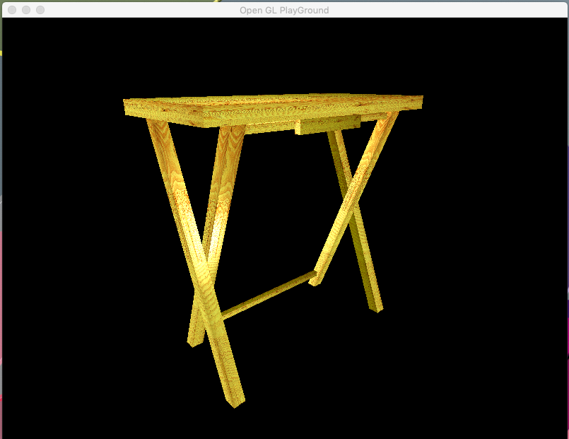
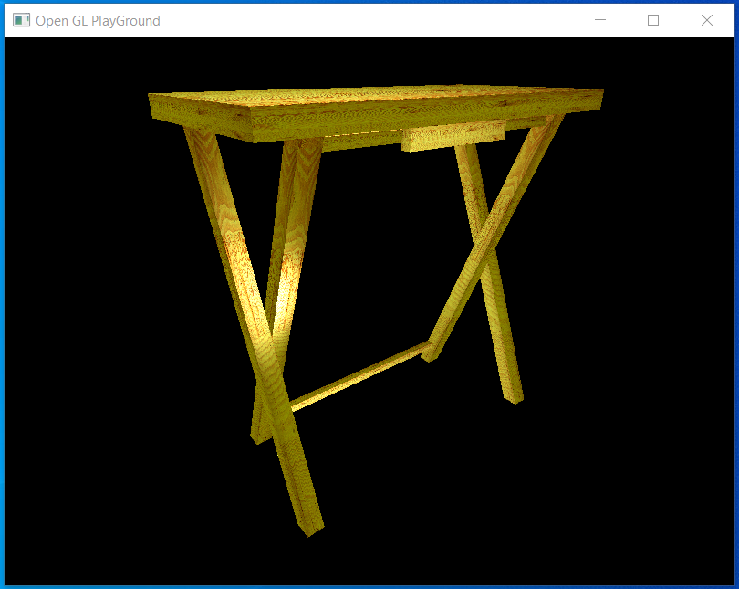

# OpenGL in C++ and Java
OpenGL is a powerful cross platform graphics library. It has capabilities which enable it to be used in complex video games, computer animation and much more. For me, OpenGL is a tool much like so many others, something to leverage as needed to complete tasks as demanded.

The projects highlighted here are essentially two implementations of the same idea. The creation of a representation of a real-world object in a simple OpenGL environment, in this case a tray table used for eating dinner while watching my favorite movies on streaming services.

## C++
Initially developed in C++ the project highlights the basic set of OpenGL capabilities such as lighting, texture mapping, movement. There are two caveats to this project.
- C++ is not my forte
  - I'm capable of working in C++ and can understand what is happening in any C++ implementation. However, I haven't used it regularly in such a long time I've forgotten many of the finer point s of the language when it comes to creating modular, encapsulated code.
- This is my initial foray into OpenGL, as such many of the components are fairly unrefined. The work, they do what they are supposed to do, but it doesn't look all that pretty in the code.

Please feel free to examine the code base, [located here](https://github.com/matthew-spencer-1/openGL_CPP).  

## Java
Java has been my primary development language for more than a decade. While I have taken many trips through the lands of Python, .Net, C, and many others, it seems Java is where I always end up sooner or later. Learning OpenGL in C++ two things continually frustrated me:
- The materials for learning the libraries are restricted to a Windows implementation of C++
 - Many of the libraries are functionally equivalent, but named slightly differently in a Linux or MacOS environment. Thus meaning to work on my Mac, I would need to re-write the code prior to turning it in for assessment. Frankly, that's too much work.
 - Not being well versed in C++, it bothered me building everything in a single, long, .cpp file.

Reimplementing the project in Java solved those two problems for me. Additionally, it brought about a third problem I didn't know I had
- More modular, far cleaner implementation
- Cross platform compatibility
- Far better understanding of the workings of OpenGL
  - The code base for the implementation is located [here](https://github.com/matthew-spencer-1/openGL_Java).
  - Rendering in Java is slightly different than that of C++. This is largely due to different lighting design between the two implemenations

| Java on Mac | Java on Windows |
| :---: | :---: |
|  |  |
